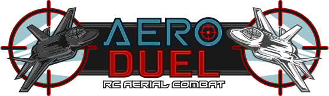

  
   
  

   
  
   
  
   
  <h1>Aeroduel Server Roadmap</h1>

---

## Completed

### Core Server Architecture
Get Next.js running inside Electron. The desktop application must run its own 
server locally and allow use of API endpoints. It must be able to host a server
on the local network and support web sockets with other devices.

### Production Packaging
Package native binaries for Linux/Windows/Mac.

### Basic frontend for desktop app UI
Use Next.js and React to build a basic desktop UI with a single button to start 
a match on the local network.

### Local Server Hosting
Next.js API available via LAN at `aeroduel.local:45045` at all times while app 
is running.  
Note: Some mobile devices may not be able to connect to `aeroduel.local`. A 
workaround for this is a stretch goal.

### Game Logic Implementation
Hit processing and score tracking. When a plane locks on to the target, it sends
a signal to the server confirming a hit. The server then updates the score and 
sends web socket updates to all connected mobile devices.  
Note: The server does not yet use WebSockets to communicate with mobile devices.

## In Progress

### Database Integration
~~MongoDB/PostgreSQL or local database for match state~~. Store game state in 
memory. Include API endpoints to read data but do not allow clients to write, 
not even when joining matches (the server will handle that if the endpoint for 
joining a match does not fail).

### Documentation
Write up a detailed markdown API.md for the server endpoints. This helps other 
developers understand the server when forking and editing the code, perhaps even
to use the API in their own projects.

### WebSocket connections
Implement a WebSocket connection with the mobile app and ESP32s. This allows
the server to send updates to the mobile app when a plane hits the target and
send commands to the planes, for example, to flash their lights or tell them
they've been hit. WebSockets also allows the server to assume the plane has
been powered off if it loses the WebSocket connection for more than a few
seconds.

## Todo

### RC Plane Registration/Linking
Users will be able to register their plane with the mobile app. The mobile app 
will assign a unique ID to that plane and associate it with its user as the 
pilot. There is a somewhat lengthy process for linking planes to users, but it 
will be mostly automated. In short, the mobile app will display a list of planes
that are online and not linked; the user can select one to flash its lights,
and then confirm that's the correct plane if the one they want to link is 
flashing its lights. Finally, the mobile app will save the plane's ID to the user's
account and the plane will save the userID to its persistent storage. This 
requires programming across all three platforms — the server, mobile app, and 
arduino.

---

## Next steps

- Fix bug where api/register can be called on a plane that's already registered
- Add an endpoint for configuring a match if it hasn't started yet\*
- Add an endpoint for ending a match
- Create a WebSocket server
- Add unit testing
- Add CI/CD for unit tests\*

\*: Stretch goal
